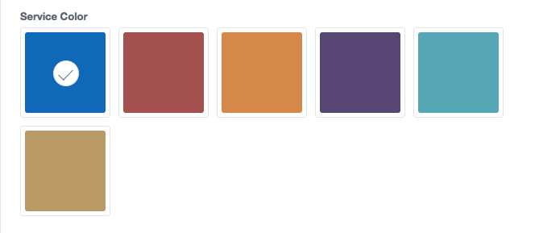
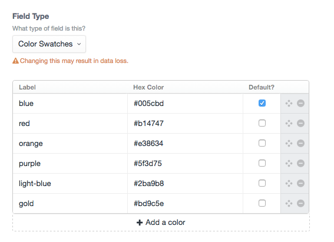

# Color Swatches plugin for Craft CMS

Choose a color from a selection of admin defined colors



## Installation

To install Color Swatches, follow these steps:

1. Download & unzip the file and place the `colorswatches` directory into your `craft/plugins` directory
1. Install plugin in the Craft Control Panel under Settings > Plugins
1. The plugin folder should be named `colorswatches` for Craft to see it.  GitHub recently started appending `-master` (the branch name) to the name of the folder for zip file downloads.

Color Swatches works on Craft 2.4.x and Craft 2.5.x.

## Color Swatches Overview

Instead of providing a user a full color picker, Color Swatches gives an admin the ability to provide a selection of colors for a user to choose from.

## Configuring Color Swatches

Create a Color Swatches field and provide label and hex value options.



## Using Color Swatches

You can access both the label and color in your template. By default, the label will display:

```
{{ fieldName }}
{{ fieldName.label }}
{{ fieldName.color }}
```
